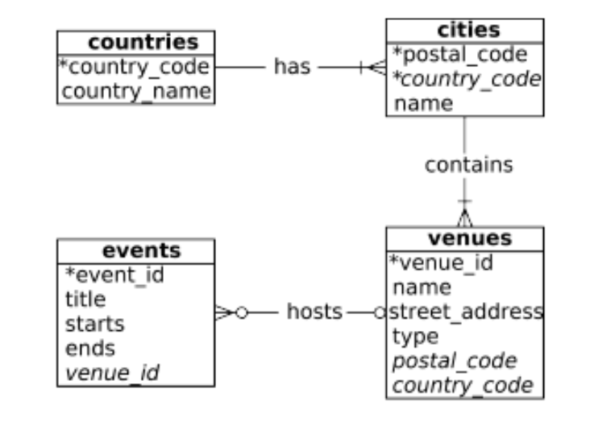

# MDB_HW3_Subaric

## Task 1: Connecting a Database to an Application

### Overview
The goal of this assignment is to become comfortable connecting a database to an application. You need to create an application that lets a user interact and manage the following tables from our in-class example:



### Getting Started

To get started with this assignment, follow these steps:

1. Clone this repository to your local machine:
   ```bash
   git clone https://github.com/yourusername/MDB_HW3_Subaric.git

2. Connecting to Postgres Database with Python or Java
    * Python - https://www.postgresqltutorial.com/postgresql-python/connect/
   
## 3. Create Menu Functionality

Your menu interface should have the following functionality:

- **List all the countries:** Display a list of all the countries in the database.
    ```bash
    # Function to list all countries
    def list_countries(connection):
        try:
            with connection.cursor() as cursor:
                cursor.execute("SELECT DISTINCT country_name FROM homework.countries")
                countries = cursor.fetchall()
                for country in countries:
                    print(country[0])
        except psycopg2.Error as e:
            print("Error listing countries:", e)

- **Search for/select a city/cities based on postal code, country code, and/or name:** Provide a search feature that allows users to search for and select cities using criteria such as postal code, country code, and city name.
     ```bash
    # Function to search for/select a city/cities based on postal code, country code, and/or name
    def search_cities(connection):
        try:
            with connection.cursor() as cursor:
                # Gather search criteria
                city_name = input("Enter the city name (leave empty for any): ")
                country_code = input("Enter the country code (leave empty for any): ")
                postal_code = input("Enter the postal code (leave empty for any): ")

                # Build the SQL query dynamically based on the provided criteria
                query = "SELECT * FROM homework.cities WHERE TRUE"
                parameters = []

                if city_name:
                    query += " AND name = %s"
                    parameters.append(city_name)

                if country_code:
                    query += " AND country_code = %s"
                    parameters.append(country_code)

                if postal_code:
                    query += " AND postal_code = %s"
                    parameters.append(postal_code)

                cursor.execute(query, parameters)
                cities = cursor.fetchall()

                if cities:
                    print("Matching cities:")
                    for city in cities:
                        print(city)
                else:
                    print("No cities found matching the criteria.")

        except psycopg2.Error as e:
            print("Error searching for cities:", e)

- **Add a new city to the cities table:** Implement a feature that enables users to add a new city to the cities table, including providing details such as city name, country code, and postal code.
    '''bash
    # Function to add a new city to the cities table
def add_city(connection):
    try:
        with connection.cursor() as cursor:
            # Gather information for the new city
            city_name = input("Enter the city name: ")
            country_code = input("Enter the country code: ")
            postal_code = input("Enter the postal code: ")

            # Insert the new city into the table
            cursor.execute(
                "INSERT INTO homework.cities (name, country_code, postal_code) "
                "VALUES (%s, %s, %s)",
                (city_name, country_code, postal_code)
            )
            connection.commit()  # Commit the transaction
            print(f"Added {city_name} to the cities table.")

    except psycopg2.Error as e:
        connection.rollback()  # Rollback the transaction in case of an error
        print("Error adding city:", e)

- **Update a city name, country code, and/or postal code:** Allow users to update existing city records by modifying attributes such as city name, country code, and postal code.
    '''bash
    # Function to update city information
    def update_city(connection):
        try:
            with connection.cursor() as cursor:
                city_name = input("Enter the city name to update: ")
                new_city_name = input("Enter the new city name: ")
                new_country_code = input("Enter the new country code: ")
                new_postal_code = input("Enter the new postal code: ")

                # Update the city information
                cursor.execute(
                    "UPDATE homework.cities "
                    "SET name = %s, country_code = %s, postal_code = %s "
                    "WHERE name = %s",
                    (new_city_name, new_country_code, new_postal_code, city_name)
                )
                connection.commit()  # Commit the transaction
                print(f"Updated information for {city_name}.")
        except psycopg2.Error as e:
            connection.rollback()  # Rollback the transaction in case of an error
            print("Error updating city:", e)


    - **Delete a city:** Implement the ability to delete a city from the database.
        '''bash
        # Function to delete a city
    def delete_city(connection):
        try:
            with connection.cursor() as cursor:
                city_name = input("Enter the city name to delete: ")

                # Check if the city exists before deleting
                cursor.execute(
                    "SELECT name FROM homework.cities WHERE name = %s",
                    (city_name,)
                )
                existing_city = cursor.fetchone()

                if existing_city:
                    # Delete the city if it exists
                    cursor.execute(
                        "DELETE FROM homework.cities WHERE name = %s",
                        (city_name,)
                    )
                    connection.commit()  # Commit the transaction
                    print(f"{city_name} has been deleted from the cities table.")
                else:
                    print(f"{city_name} does not exist in the cities table.")
        except psycopg2.Error as e:
            connection.rollback()  # Rollback the transaction in case of an error
            print("Error deleting city:", e)

            
